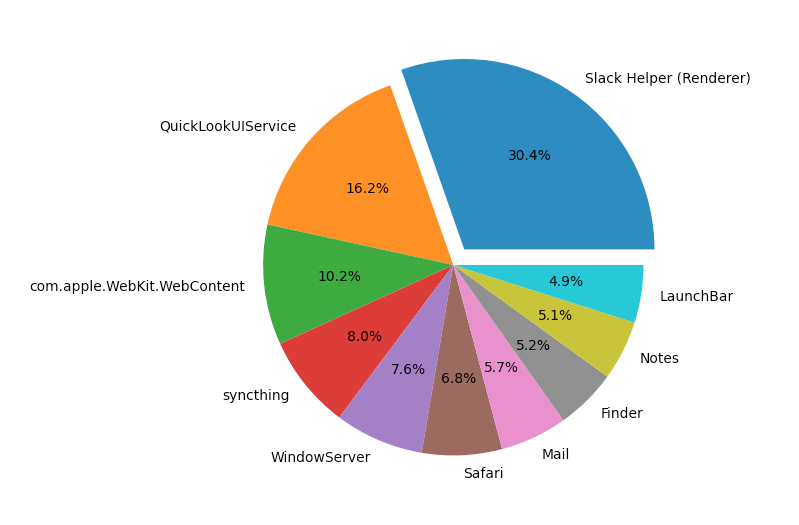

# mem.py

Ever wonder which apps are using the most memory on your Mac? This little script will tell you. 



## Install

```sh
$ pip3 install matplotlib
$ ./mem.py
```

## References

https://apple.stackexchange.com/a/4296/27711

https://pythonspot.com/matplotlib-pie-chart/